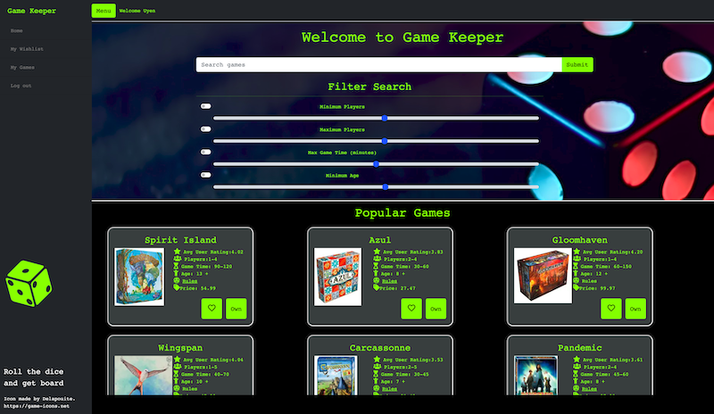
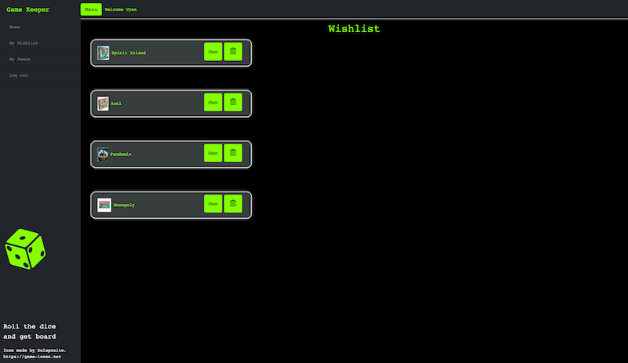

# Game Keeper

    
## Table of Contents
==================
* [Description](#Description)
* [Technologies](#Technologies) 
* [User Stories](#UserStories)
* [license](#License) 
* [Collaborators](#Collaborators)
* [Questions](#Questions)
* [Examples](#Examples)

==================
    
## Description

Game Keeper is an App to Explore, Search, Filter and Save your favorite board games. The main page has search function to search through a large database of board games with information about players, playtime, min. recommended age, user rating, price and even rules. You can login and save games you would like to buy as well as store games you own to your personal logins. 

Filtering is also available to help find certain games by amount of players, game time and minimum age.

Check out the deployed link hosted on Heroku [here](https://game-keeper-app.herokuapp.com/). You can use this account to test the site: 
 Email: test@yahoo.com
 Password: test

### Screenshots

## Technologies

* Javascript for site logic and functionality
* Node to download packages
* Handlebars for HTML pages
* Passport to handle authentication
* JWT for securing logins with web token
* Express for creating server
* MySQL for database 
* Seqelize to interact with database 
* Board game atlas API to pull all board game info from thier Database
* Heroku to deploy site
* JawsDB to host Database while on Heroku
* Bootstrap for User Interface
* GSAP for animation of die and welcome
* Font Awesome Library for icons

    
## UserStories
As an avid Board game player I want to be able to search board games Then I am able to filter games by categories, amount of players, and age levels.

As I search I want to keep track of all the games I want to play.

Then I am able to log in and save games to a wishlist where I can come back and look through the games I’d like to get and play.

As I keep track of the games I want, I want to organize ones I have already played and own,

Then I can filter my wishlist into played and own games.

As a player who plays a lot of the games I want to keep track of what I like and don’t like about each game

Then I am able to leave comments about each game.

As I build my collection saved in my account

Then I can search through my saved wishlist and own list.

As an owner of a large collections I want to be able to pick a game to play

Then I can use filters to pick number of players and age and be given a random game from my own list to play that night.
### License

This application is covered under the MIT License. Please see any additional files in GitHub for details.
### Collaborators

This page was created collectively by Uyen Nguyen, Rachel Kroetch, Rebecca Blanton, and Madeline Morris.
### Questions

If you have any questions please reach out at our Sites
* [Uyen Nguyen](https://github.com/uyennguyen30696)
* [Rachel Kroetch](https://github.com/rekroetch)
* [Becca Blanton](https://github.com/BeccaBlanton)
* [Madeline Morris](https://github.com/madehopemorr)

### Future improvement

* Improve the appearance and consistency of UI elements (ex: button color on hover and on clicked)

* Improve mobile version

* Prevent the game cards to be out of shape when changing screen size

* Better style for wishlist and my games list in members page

* Replace heart and own buttons with check marks or alert message if the game is already in wishlist or owned

* Add click event to autocomplete list
